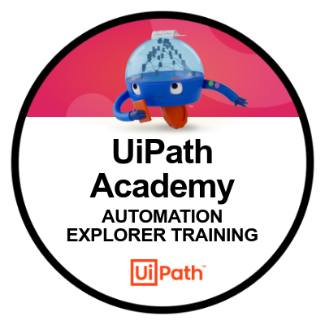

# Automation Developer Training

## UiPath Academy

**79h 55m**

### Explorer Training
- [x] Explore automation development with UiPath Studio
- [x] Build your first process with Studio
- [x] Variables, Constants and Arguments in Studio
- [x] Control Flow in Studio
- [x] Excel Automation with the Modern Experience in Studio
- [x] User Interface (UI) Automation with Modern Design in Studio

### Associate Training
- [ ] Data Manipulation with Strings in Studio
- [ ] Data Manipulation with Lists and Dictionaries in Studio
- [ ] UI Automation Synchronization with Studio
- [ ] UI Automation Descriptors in Studio
- [ ] Selectors in Studio Deep Dive
- [ ] Debugging in Studio
- [ ] Error and Exception Handling in Studio
- [ ] Working with Local Files and Folders in Studio
- [ ] Email Automation With Studio
- [ ] PDF Automation with Studio
- [ ] Data Manipulation with Data Tables in Studio
- [ ] Introduction to Logging in Studio
- [ ] Orchestrator Overview for Automation Developers
- [ ] Working with Orchestrator Resources
- [ ] Object Repository in Studio
- [ ] UiPath Integration Service Overview
- [ ] Version Control Systems Integration in Studio
- [ ] Workflow Analyzer in Studio
- [ ] RPA Testing with Studio
- [ ] Project Organization in Studio
- [ ] Automation Implementation Methodology Fundamentals

###  Professional Training

- [ ] State Machines in Studio
- [ ] Introduction to Robotic Enterprise Framework
- [ ] Building a REFramework Project with Orchestrator Queues
- [ ] Building a REFramework Project with Tabular Data
- [ ] Practice with REFramework
- [ ] Orchestrator Triggers and Monitoring
- [ ] Advanced Data Manipulation with Studio
- [ ] Advanced UI Automation with Studio
- [ ] AI Computer Vision with Studio
- [ ] Remote Debugging with Studio
- [ ] Invoke Method and Invoke Code in Studio